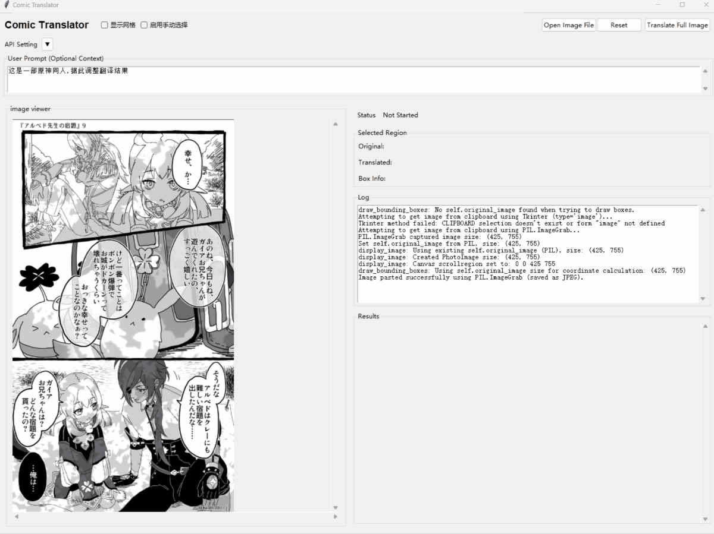

# 漫画翻译器 (Comic Translator)

> **Warning**
> 本项目代码由 LLM 生成，未经过充分测试，可能存在以下问题:
> - 代码质量无法保证
> - 可能存在潜在 bug 
> - 缺乏单元测试和集成测试
> - 不建议用于生产环境
>
> 使用时请谨慎，风险自负。


一个图形用户界面（GUI）工具，利用大型语言模型（如 GPT-4 Vision）来翻译漫画图像中的文本。它能识别文本区域，提取原文，将其翻译成简体中文，并将结果与带有边界框的图像并排显示。


(Credit: https://x.com/kemono_j/status/1917578723542589572/photo/2)

## 提示
推荐使用 Gemini 2.0 Flash 模型，价格便宜且效果尚可。


## 功能

*   **图像加载**: 通过文件对话框或从剪贴板粘贴 (Ctrl+V) 加载图像。
*   **全图翻译**: 自动翻译图像中的所有检测到的文本。
*   **手动选择翻译**: 允许用户手动选择图像上的特定区域进行翻译。
*   **结果展示**: 在可滚动的卡片区域中显示原文和翻译文本。
*   **交互式高亮**: 点击结果卡片时，在图像上高亮显示相应的文本区域。
*   **边界框**: 在检测到的文本区域周围绘制边界框。
*   **API 配置**: 可通过 UI 或 `.env` 文件配置 API 设置（Endpoint, Model Name, API Key）。
*   **用户提示**: 可选的用户提示框，用于向 LLM 提供上下文信息。
*   **实时状态**: 显示实时状态更新，包括 API 响应流进度和 token 使用量。
*   **日志记录**: 提供详细的日志记录区域。
*   **网格叠加**: 可在图像上叠加可选的坐标网格。
*   **重置功能**: 清除当前结果和状态。

## 工作原理

1.  用户加载图像（通过文件或粘贴）。
2.  **全图翻译**: 完整的图像被发送到配置的 LLM Vision API 端点（例如 OpenAI GPT-4V）。提示指示模型查找文本，将其翻译成简体中文，并以 JSON Lines (JSONL) 格式返回结果，包括归一化的边界框坐标 (`[ymin, xmin, ymax, xmax]`)。应用程序流式接收响应，解析每个 JSONL 对象，并逐步更新 UI。
3.  **手动翻译**: 用户启用"手动选择"模式并在图像上绘制一个矩形。选定的区域被裁剪并发送到 API。提示要求返回一个包含该片段原文和翻译文本的简单 JSON 响应。
4.  结果（原文、译文、边界框）显示在右侧的卡片中。边界框绘制在图像画布上。
5.  点击结果卡片会高亮图像上的相应框，并在"选中区域"部分显示详细信息。

## 安装

1.  克隆仓库
2.  安装依赖：

    ```bash
    pip install -r requirements.txt
    ```

    或者使用 uv：

    ```bash
    uv pip install -r requirements.txt
    ```

## 使用方法

1.  运行程序：
    ```bash
    python comic_translator.py
    ```
2.  **(首次使用/可选)** 在 "API Setting" 部分配置 API Endpoint、Model Name 和 API Key，或创建一个 `.env` 文件（如果提供了 `.env.example`，请参考）。
3.  使用 "Open Image File" 按钮加载图像，或复制图像并在应用程序窗口中按 Ctrl+V 粘贴。
4.  **(可选)** 修改 "User Prompt" 文本区域以提供翻译上下文。
5.  点击 "Translate Full Image" 按钮翻译所有检测到的文本。结果将显示为卡片，并在图像上显示边界框。
6.  **(可选)** 翻译特定区域：
    *   勾选 "启用手动选择" (Enable Manual Selection) 复选框。
    *   在图像上单击并拖动以在所需文本周围绘制矩形。
    *   释放鼠标按钮以触发所选区域的翻译。将添加新的结果卡片和边界框。
7.  点击结果卡片以查看图像上高亮的相应区域。
8.  使用 "Reset" 按钮清除当前图像的结果和状态。
9.  切换 "显示网格" (Show Grid) 复选框以在图像上叠加坐标网格。

## 要求

*   Python 3.8+
*   `openai` 库
*   `Pillow` 库 (PIL fork) 用于图像处理
*   `python-dotenv` 用于从 `.env` 文件加载 API 密钥
*   兼容的视觉语言模型（例如 OpenAI GPT-4 Vision 或通过自定义端点的等效模型）的 API 密钥。 